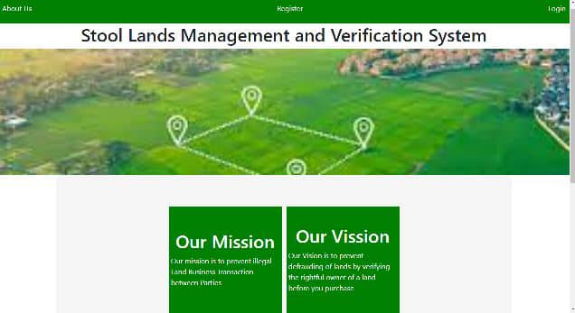

# Land Management System

## Project Description

This is a web application built with Python Django Framework to manage and administer parcels of Land. This project aims to solve Land litigation issues and Fraudulent

## Table of Contents

- [Installation](#installation)
- [Dependencies](#dependencies)
- [Usage](#usage)
- [Contribution](#contribution)

## Installation

Follow these steps to set up and run the project:

1. Clone this repository:

      git clone https://github.com/martinaborgeh/Land_Management_System.git

2. Download and install Python and an IDE (e.g., PyCharm or VS Code).

3. Open the cloned folder as your project directory.

4. Install the required dependencies:

pip install Django, Gdal, Pyproj,Leaflet,Postgis, PostGreql,Psycop2,Pillow.

## Dependencies

The project relies on the following dependencies:

- Django
- Gdal
- Pyproj
- Postgis
- Psycop2
- Pillow
- PostgreSql

## Usage

1. Create Database using pgAdmin with the same database credential as specified in settings.py.
2. Run python manage.py makemigratings, python manage.py migrate.
3. Run python manage.py CreateSuperuser and specify your admin Credentials.
4. Run python manage.py runserver, copy the url provided in the terminal and paste in any browser.
5. Navigate to admin panel and add coordinates of parcels. The coordinates must be in Ghana National Grid Coordinate System.
6. Signup and login into the client page and search for 1 or more parcels by entering 1 parcel or at most three parcel IDs to view the details of the lands

<!-- You can add screenshots or GIFs here to demonstrate the usage -->

## Contribution

We welcome contributions to this project! If you'd like to get involved, please follow these steps:

1. Fork the repository.
2. Create a new branch for your feature or bug fix.
3. Make your changes and commit them.
4. Open a pull request to merge your changes into the main branch.
